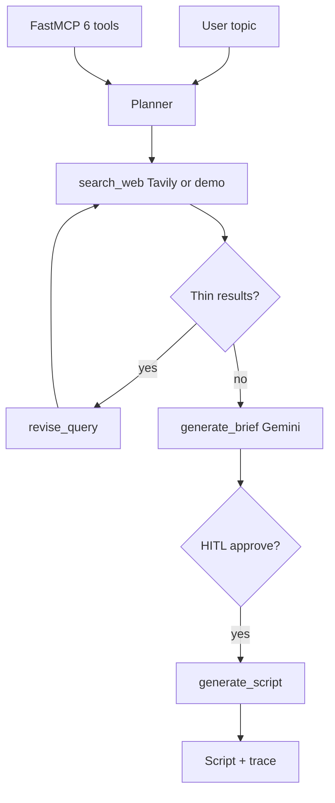

# StoryForge Agent

### Gemini + Tavily research agent that plans, searches, revises thin results, and drafts short-form video scripts

[](https://github.com/ArchanaChetan07/StoryForge-Agent/actions/workflows/ci.yml)
[](https://www.python.org/)
[](tests/)
[](mcp_server.py)

Streamlit + MCP agent that turns a topic into a researched brief and optional video script. Uses a **plan → search → observe → revise → brief → (HITL) → script** loop with **4 internal tools** and **6 FastMCP tools**. Runs fully offline in **DEMO_MODE** when Gemini/Tavily keys are missing.

---

## Key Results

| Metric | Value | Source |
|---|---|---|
| Internal agent tools | **4** (`search_web`, `revise_query`, `generate_brief`, `generate_script`) | `agent/tools.py` |
| MCP tools exposed | **6** | `mcp_server.py` |
| Python modules | **17** | git tree |
| Unit tests | **14** | `tests/test_storyforge.py`, `test_agent_loop.py` |
| LLM providers | Gemini (`google-generativeai`), Tavily search | `requirements.txt` |
| UI | Streamlit | `app.py` |
| Offline path | `DEMO_MODE` stubs in `utils/search.py`, `utils/generator.py` | `utils/config.py` |

---

## Architecture



**How it works:** the planning loop searches the web, broadens the query deterministically when observations are thin, summarizes with Gemini (or demo text), optionally waits for human approval, then emits a short-form script with CTA lines. MCP exposes the full loop plus granular search/summarize/script endpoints.

---

## Tech Stack

| Layer | Choice |
|---|---|
| Agent loop | Custom planner + tool registry (`agent/loop.py`) |
| Search | Tavily API or deterministic demo hits |
| Generation | Google Gemini via `utils/generator.py` |
| MCP | `mcp` FastMCP stdio server |
| UI | Streamlit |
| Tests | pytest |

---

## Features

- Structured execution trace for debugging (`utils/tracing.py`)
- HITL gate before script generation (bypass with `auto_approve=True`)
- MCP tools: `research_topic`, `create_video_script`, `run_storyforge_agent`, plus low-level helpers
- Offline CI-friendly stubs — no API keys required for pytest
- `.env.example` documents `GEMINI_API_KEY`, `TAVILY_API_KEY`, `DEMO_MODE`

---

## Installation & Usage

```bash
git clone https://github.com/ArchanaChetan07/StoryForge-Agent.git
cd StoryForge-Agent
pip install -r requirements.txt
cp .env.example .env
```

```bash
# Offline tests
pytest -q

# Streamlit UI
streamlit run app.py

# MCP server (stdio)
mcp dev mcp_server.py
```

---

## Project Structure

```text
StoryForge-Agent/
├── agent/           # loop, planner, tools, HITL
├── utils/           # search, generator, config, tracing
├── mcp_server.py    # 6 MCP tools
├── app.py           # Streamlit entry
└── tests/           # 14 pytest tests
```

---

## License

See repository license file if present.
