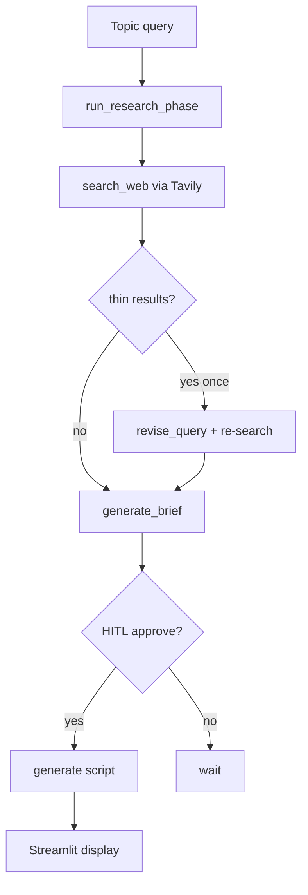
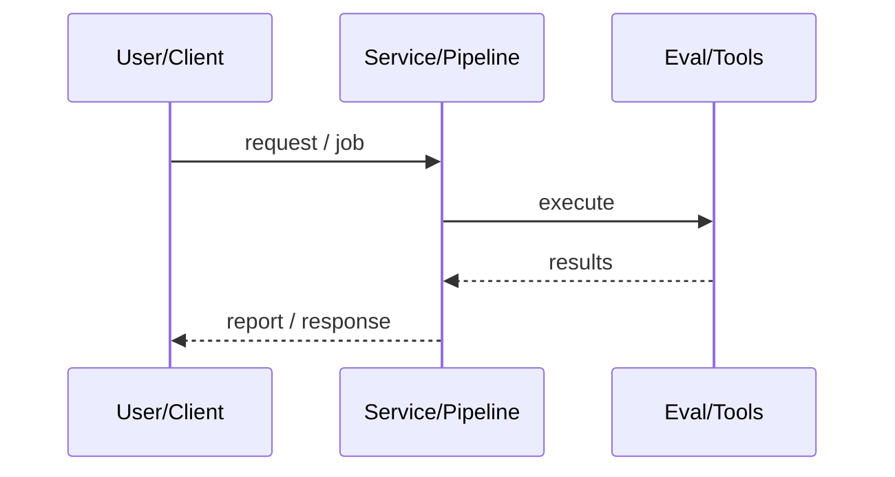
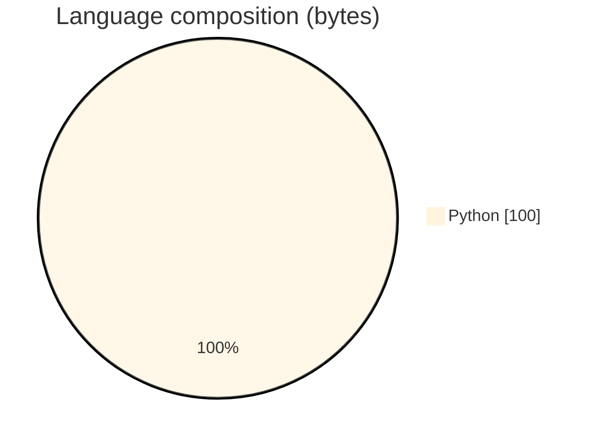

# StoryForge Research-to-Script Agent

### Plan → search → revise thin results → brief → HITL → shoot-ready script.

[](https://github.com/ArchanaChetan07/StoryForge-Agent)
[](https://github.com/ArchanaChetan07/StoryForge-Agent)
[](https://github.com/ArchanaChetan07/StoryForge-Agent)
[](https://github.com/ArchanaChetan07/StoryForge-Agent/actions)

---

## Overview

Creators need structured research briefs and scripts from live web sources with human approval before final generation.

Streamlit UI drives agent/loop with planner that searches (Tavily), revises once if thin, generates brief, then HITL-gated script using Google Generative AI; MCP server exposes tools; DEMO_MODE stubs when keys missing.

Agentic storytelling assistant with traces, HITL, and MCP surface.

This repository is maintained as **production-minded portfolio work**: clear architecture, automated checks where present, and metrics that are **traceable to committed artifacts** (never invented).

---

## Architecture

Topic query → run_research_phase (plan/search/revise/brief) → optional HITL approve → run_script_phase → display sources + script; MCP mirrors tools.





---

## Results & repository facts

> Only values found in code, configs, tests, or generated reports are listed. Absence of a clinical/ML accuracy number means it was **not** published in-repo.

| Metric | Value | Source |
|---|---|---|
| Tracked repository files | **22** | `git tree` |
| Python modules | **17** | `git tree *.py` |
| Tracked files | **22** | `git tree` |
| Python modules | **17** | `git tree` |
| Test-related paths | **3** | `git tree` |
| CI workflows | **Yes** | `.github/workflows` |
| Docker present | **No** | `repo root` |



---

## Key features

- Research phase: search → observe → revise if thin → brief
- HITL approval before script generation
- Source cards in UI
- Demo mode stubs
- MCP server companion
- Tracing spans for debug

---

## Tech stack

| Layer | Technology |
|---|---|
| ui | Streamlit |
| llm | Google Generative AI |
| search | Tavily |
| mcp | MCP |
| ci | GitHub Actions |

---

## Skills demonstrated

Python · S · t · r · e · a · m · CI/CD · testing · automation

Keyword surface: **Python · Python · machine-learning · CI/CD · testing · API · Docker · automation · data-science · software-engineering · system-design · observability · LLM · cloud**

---

## Project structure

```text
StoryForge-Agent/
├── app.py
├── mcp_server.py
├── agent/{loop,planner,tools,hitl,types}.py
├── utils/{config,generator,search,styles,tracing}.py
├── tests/
├── requirements.txt
└── .env.example
```

---

## Installation & usage

```bash
git clone https://github.com/ArchanaChetan07/StoryForge-Agent.git
cd StoryForge-Agent
pip install -r requirements.txt
cp .env.example .env
streamlit run app.py
```

---

## How it works

Entering a topic runs the research agent: search, optionally revise thin results (min sources/chars), synthesize a brief, then after approval generate a script. Missing API keys flip DEMO_MODE for stubbed search/generation.

---

## Future improvements

- Publish MIN_SOURCES/MIN_RAW_CHARS defaults in README
- Add eval set for brief/script quality

---

## License

See repository.

---

<p align="center">
  <b>StoryForge Research-to-Script Agent</b><br/>
  <a href="https://github.com/ArchanaChetan07/StoryForge-Agent">github.com/ArchanaChetan07/StoryForge-Agent</a>
</p>
